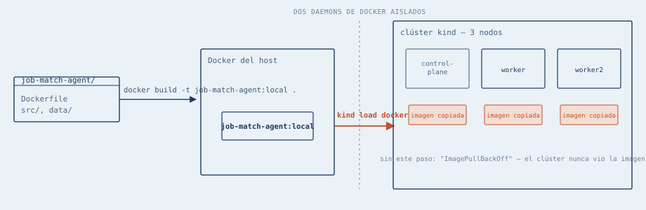
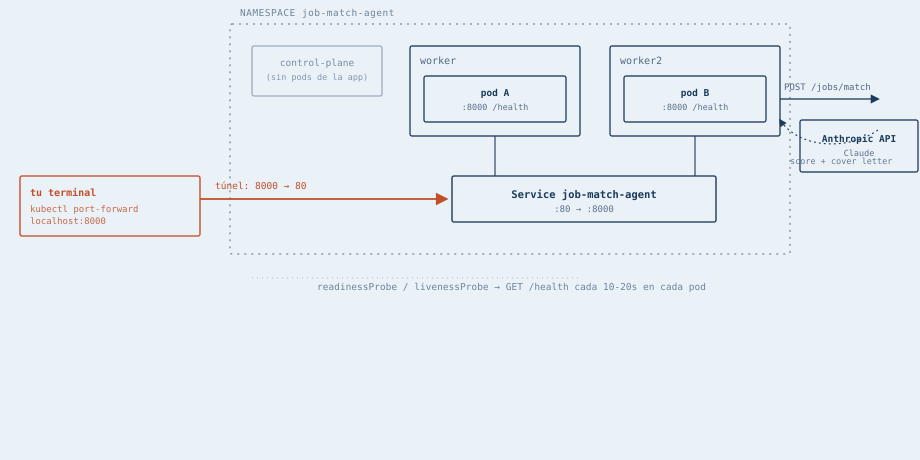

# k8s-job-match-agent

Despliega [job-match-agent](https://github.com/jpberarducci/job-match-agent)
en un clúster de Kubernetes local **multi-nodo**, demostrando los
conceptos básicos: `Deployment` con múltiples réplicas repartidas entre
nodos, `Service`, `Secret`, `Namespace` y health probes
(`readinessProbe`/`livenessProbe`).

## Diagramas

**Build & load** — cómo la imagen cruza de tu Docker al Docker aislado de `kind`:

<picture>
  <source media="(prefers-color-scheme: dark)" srcset="diagrams/01-build-and-load-dark.svg">
  
</picture>

**Topología y camino de un pedido** — dónde queda cada pod y cómo llega un request de punta a punta:

<picture>
  <source media="(prefers-color-scheme: dark)" srcset="diagrams/02-topology-and-request-path-dark.svg">
  
</picture>

## Prerrequisitos

- Docker
- [`kubectl`](https://kubernetes.io/docs/reference/kubectl/) — la CLI
  estándar para hablarle a cualquier clúster de Kubernetes, sea local o en
  la nube. Es la que se usa en los pasos de abajo.
- [`kind`](https://kind.sigs.k8s.io/) (Kubernetes in Docker) — arma el
  clúster local contra el que corren esos comandos. Acá se usa con
  `kind-config.yaml`, que pide 3 nodos (1 control-plane + 2 workers) en
  vez del único nodo por defecto — así los 2 pods de la app quedan
  repartidos en máquinas distintas, no amontonados en una sola.

## Cómo correrlo

1. Parado en la carpeta de este repo, cloná `job-match-agent` al lado
   (no adentro) y buildeá su imagen:

```bash
git clone https://github.com/jpberarducci/job-match-agent ../job-match-agent
cd ../job-match-agent
docker build -t job-match-agent:local .
cd ../k8s-job-match-agent
```

2. Creá el clúster local y cargale la imagen (`kind` corre en un Docker
   aislado propio, separado del Docker de tu sistema — por eso la imagen
   que acabás de buildear no está disponible ahí hasta que la cargues a
   mano):

```bash
kind create cluster --name job-match-agent --config kind-config.yaml
kind load docker-image job-match-agent:local --name job-match-agent
```

3. Creá el namespace:

```bash
kubectl apply -f k8s/namespace.yaml
```

4. Copiá la plantilla del secret y completá tu `ANTHROPIC_API_KEY` real
   (`k8s/secret.yaml` está en `.gitignore` — nunca se sube):

```bash
cp k8s/secret.example.yaml k8s/secret.yaml
# editá k8s/secret.yaml y reemplazá "tu_api_key_aqui" por tu key real
kubectl apply -f k8s/secret.yaml
```

5. Aplicá el resto de los manifiestos:

```bash
kubectl apply -f k8s/deployment.yaml
kubectl apply -f k8s/service.yaml
```

6. Esperá a que los pods estén listos:

```bash
kubectl get pods -n job-match-agent -w
```

Cuando veas `Running` y `1/1` en los dos pods, cortá el `-w` con Ctrl+C.
Con `-o wide` en vez de `-w` podés confirmar que cada pod quedó en un
nodo distinto (columna `NODE`):

```bash
kubectl get pods -n job-match-agent -o wide
```

7. Abrí el túnel — este comando se queda corriendo, **dejalo así, no le
   des Ctrl+C ni cierres la terminal** (si se corta, se corta el túnel):

```bash
kubectl port-forward -n job-match-agent svc/job-match-agent 8000:80
```

8. Desde **otra** terminal (nueva), con el túnel del paso anterior
   todavía corriendo, probalo:

```bash
curl http://localhost:8000/health
```

9. Para bajar todo:

```bash
kind delete cluster --name job-match-agent
```

## Métricas (opcional)

Sin esto, todo funciona igual — es solo para ver gráficos de CPU/memoria
en herramientas como [Lens](https://k8slens.dev/), que si no lo
encuentran muestran "Metrics are not available".

Instalá [metrics-server](https://github.com/kubernetes-sigs/metrics-server):

```bash
kubectl apply -f https://github.com/kubernetes-sigs/metrics-server/releases/latest/download/components.yaml
```

En `kind` específicamente hace falta un ajuste extra: el certificado
interno del clúster es autofirmado, y `metrics-server` lo rechaza por
defecto. Este comando le agrega la bandera `--kubelet-insecure-tls`
(aceptable en un clúster local de prueba, no en uno real/expuesto):

```bash
kubectl patch deployment metrics-server -n kube-system --type='json' \
  -p='[{"op":"add","path":"/spec/template/spec/containers/0/args/-","value":"--kubelet-insecure-tls"}]'
```

## Estructura

```
k8s-job-match-agent/
├── k8s/
│   ├── namespace.yaml
│   ├── deployment.yaml       # 2 réplicas, readiness/liveness probes
│   ├── service.yaml
│   └── secret.example.yaml   # plantilla, no el secret real
├── diagrams/
│   ├── 01-build-and-load.svg
│   ├── 01-build-and-load-dark.svg
│   ├── 02-topology-and-request-path.svg
│   └── 02-topology-and-request-path-dark.svg
├── kind-config.yaml           # 3 nodos: 1 control-plane + 2 workers
└── README.md
```
